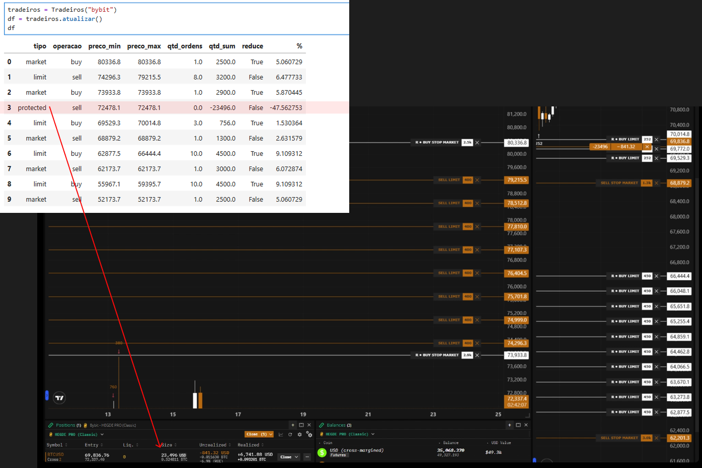
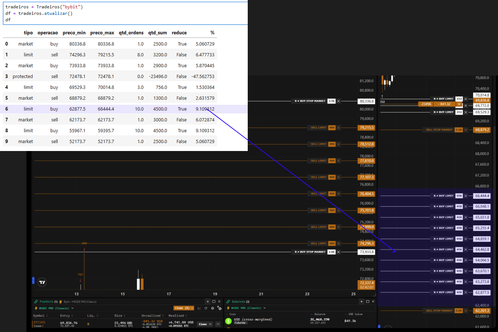
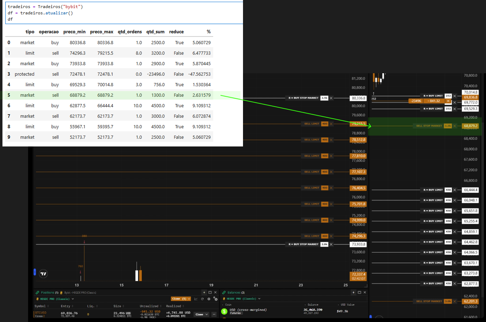

# Tradeiros Hedge Pro - Visualização de Ordens

> [!CAUTION]
> **PROJETO EM DESENVOLVIMENTO (ALPHA)**  
> Esta biblioteca está em fase inicial de desenvolvimento. Use com cautela e verifique sempre as ordens diretamente na exchange. A versão atual é focada em testes e validação da comunidade **Tradeiros**.

Este projeto é uma biblioteca Python desenvolvida exclusivamente para a comunidade **[tradeiros.com.br](https://tradeiros.com.br)**. O objetivo principal é fornecer uma visualização clara e consolidada da distribuição de ordens e dos níveis de proteção de capital em BTC, seguindo a metodologia **Tradeiros Hedge Pro**.

## 🚀 Objetivo
Facilitar o acompanhamento das estratégias de proteção em múltiplos níveis, permitindo que o usuário visualize rapidamente seu patrimônio, exposição e a distribuição das ordens de compra e venda nas principais exchanges.

## 🏦 Exchanges Suportadas
Atualmente, a biblioteca suporta as seguintes plataformas:
*   **OKX** (Testes em andamento)
*   **Bitget**  (Em desenvolvimento) 
*   **Bybit** (Em breve/Implementação inicial)

## 🛡️ Segurança (Recomendações Importantes)
A segurança dos seus ativos é prioridade absoluta:
*   **API somente leitura**: É fortemente recomendado que você crie chaves de API com permissão **apenas de consulta (Read-Only)**. Nunca habilite permissões de "Saque" ou "Operação" para uso com esta biblioteca.
*   **Conexão Direta**: Toda a comunicação ocorre diretamente entre a sua máquina e os servidores das exchanges.
*   **Privacidade**: A biblioteca é open-source, roda localmente e **não armazena, transmite ou compartilha** nenhuma informação de acesso ou credenciais.

## 📥 Instalação
A biblioteca pode ser instalada via pip (versões de desenvolvimento podem exigir a flag `--pre`):

```bash
pip install tradeiros --pre
```

## ⚙️ Configuração
Para funcionar, a biblioteca exige um arquivo `.env` no diretório raiz da execução com as suas credenciais. Utilize o modelo abaixo:

```env
# OKX
OKX_API_KEY=sua_key
OKX_API_SECRET=seu_secret
OKX_PASSPHRASE=sua_passphrase

# Bitget
BITGET_API_KEY=sua_key
BITGET_API_SECRET=seu_secret
BITGET_PASSPHRASE=sua_passphrase

# Bybit
BYBIT_API_KEY=sua_key
BYBIT_API_SECRET=seu_secret
```

## 💻 Forma de Uso
O uso foi projetado para ser o mais simples possível:

```python
from tradeiros import Tradeiros

# Inicialize para a exchange desejada ("okx" ou "bitget")
tradeiros = Tradeiros("okx")

# Recupere os dados consolidados e exiba os resultados
df = tradeiros.atualizar()

# Exiba o DataFrame e o Patrimônio consolidado
print(df)
print(f"Patrimônio Total: {tradeiros.patrimonio():.8f}")
print(f"1% do patrimônio: {tradeiros.patrimonio() * 0.01:.8f}")
```

## 📊 Ambiente Recomendado
Para uma experiência mais amigável e visual, recomendamos o uso do **Jupyter Notebook** através da distribuição **[Anaconda](https://www.anaconda.com/products/distribution)**. 
O formato de tabelas do Jupyter facilita muito a leitura do DataFrame de ordens gerado pela biblioteca.

## 🛠️ Detalhes Técnicos e Funcionamento
Esta seção descreve o funcionamento interno da biblioteca para desenvolvedores e entusiastas que desejam entender como os dados são processados.

*   **Gestão de Dados em Tempo Real**: O sistema sincroniza as ordens diretamente com a API da exchange, permitindo o cálculo instantâneo do patrimônio líquido e dos níveis de exposição. Todos os percentuais — sejam de ordens abertas, reforços (aumento de mão), realizações (diminuição) ou pontos de invalidação de blocos — são atualizados dinamicamente conforme a oscilação do preço do BTC, garantindo precisão total na execução do **Hedge Pro**. Sem precisar de calculadora e sem ter que recalcular todos os valores manualmente.
*   **Identificação Sequencial**: O motor de consolidação agrupa ordens automagicamente por tipo e operação sequencial para reduzir o ruído visual.
*   **Data de Criação**: Todas as ordens agora exibem a data original de criação (ou a data da primeira ordem do grupo).
*   **Conversão para USD**: Para exchanges Coin-M (Inverso), a biblioteca faz a conversão automática baseada no preço atual para que você veja sua exposição em Dólares.

### Visualização das Proteções e Ordens (Exemplos)

<div style="text-align: center;">
  <p><b>Short de Proteção</b></p>
  
</div>
<br>
<div style="text-align: center;">
  <p><b>Ordens Escalonadas (Grid Sequential)</b></p>
  
</div>
<br>
<div style="text-align: center;">
  <p><b>Visualização de Ordem a Mercado</b></p>
  
</div>
<br>
<br>
<br>

---
Desenvolvido para a comunidade **Tradeiros**. 🚀
